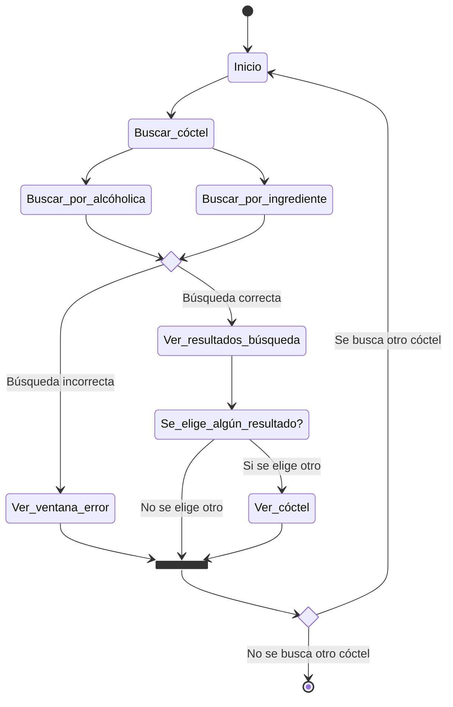
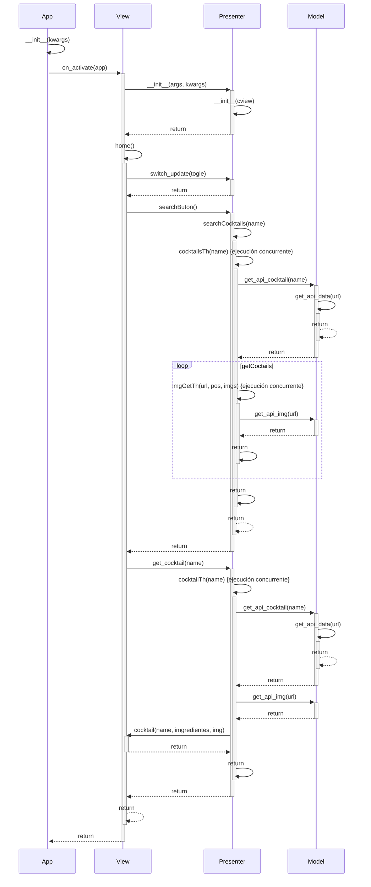
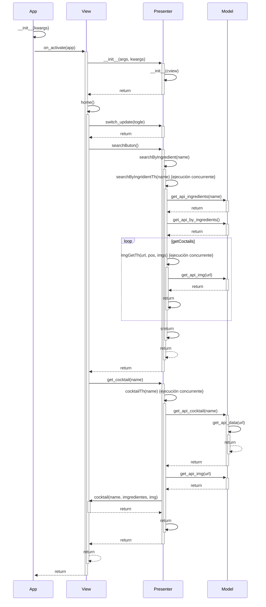
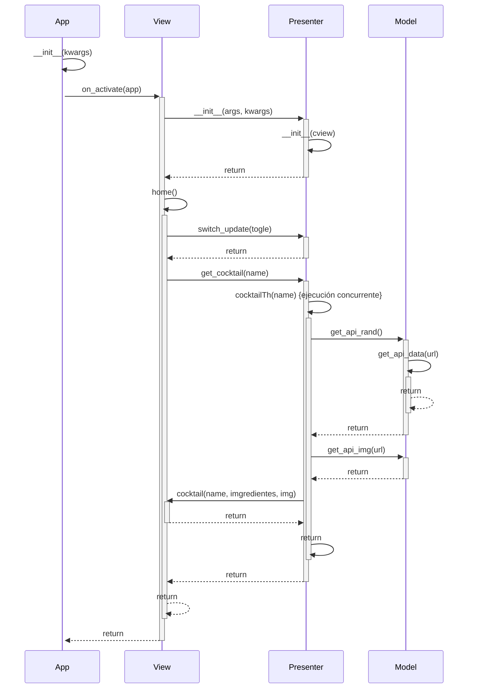
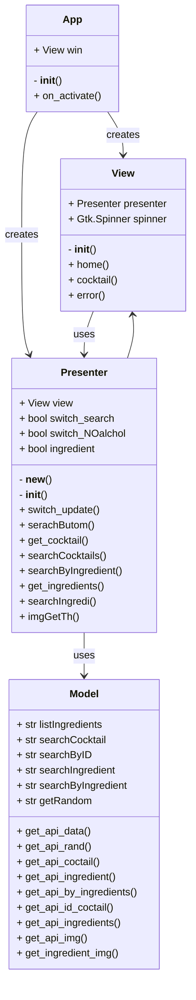

# Diseño software
Haremos uso en esta practica del patrón MVP
## Diagrama de estados

## Diagrama de secuencia
### Buscar cocktel

### Buscar ingrediente 

### Cocktel aleatorio

## Diagrama de clases

