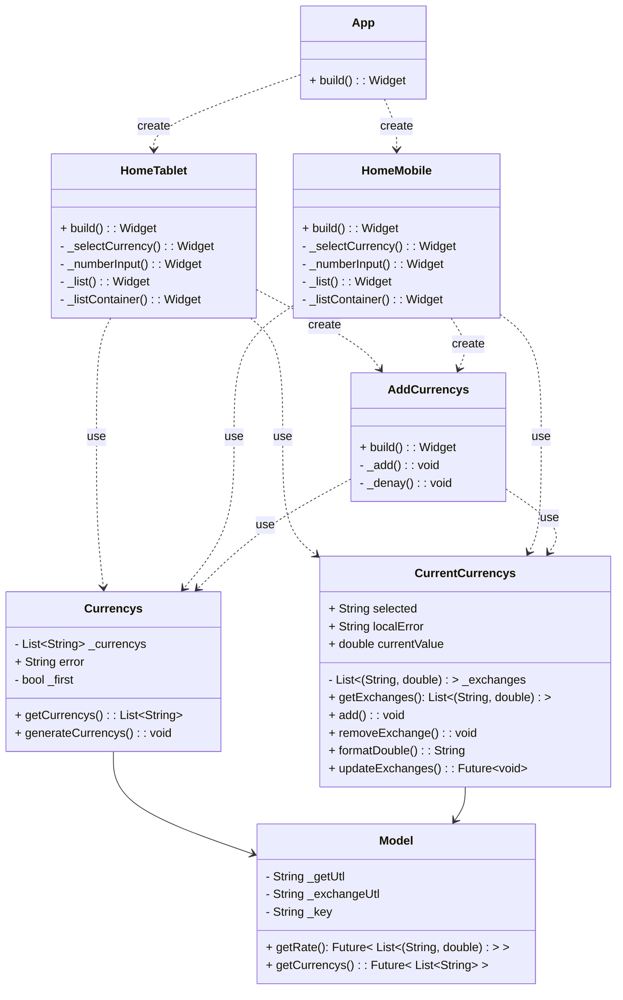
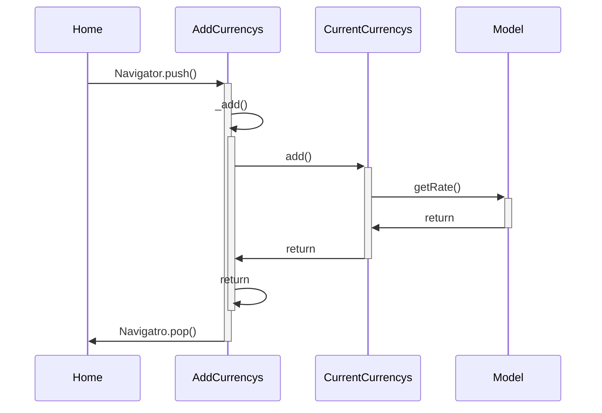
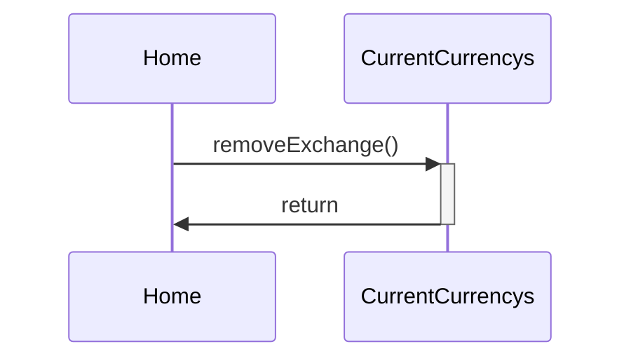

# Diseño software
En esta práctica haremos uso del patrón MVVM que a diferencia del MVP hace uso de un binder el cual en este caso será la librería provider de flutter.
## Diagrama de clases

## Diagrama secuencia
Usaremos Home como representación de HomeMobile y HomeTablet ya que funcionalmente son los mismo.
### Añadir moneda

### Eliminar moneda

